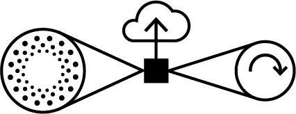

# Actor Reactor

Actor Reactor es una unidad de interacción física compuesta de:  

1. Sensor (de proximidad)
2. Procesamiento y disponibilización Web de datos
3. Actuador (motor stepper)

Este proyecto se basa en la unidad [Actor-Reactor documenta 14](https://github.com/amereida/actor-re-actor) y extiende su diseño para espacios expositivos en general. Cada unidad percibe el entorno mediante un sensor de distancia y translada esta intensidad a un motor y a un servicio Web con los datos normalizados para control sonoro mediante [Pure Data](https://puredata.info/). El actuador, definido mediante un motor stepper, variará su configuración estructural y de transmisión de la energía mecánica, dependiendo de la naturaleza del objeto expuesto.

* ver [configuración actual en una planilla](https://docs.google.com/spreadsheets/d/1H8SptrEivwXtSlFbvr6E0EB0E-gABvcepRMJ9xA1qTE/edit?usp=sharing) 

### Participantes

* [Herbert Spencer](http://wiki.ead.pucv.cl/index.php/Herbert_Spencer), Diseño de Artefactos
* [Marcelo Araya](http://wiki.ead.pucv.cl/index.php/Marcelo_Araya), Diseño de Creaturas
* [Óscar Santis](https://soundcloud.com/oscarsantis), Diseño acústico
* [Leonardo Aravena](http://wiki.ead.pucv.cl/index.php/Leonardo_Aravena), Diseño y fabricación dispositivos
* [Ismael Martinez](https://www.linkedin.com/in/ismael-martinez-8bb78ba3/), Diseño electrónico 

#### Taller de Construcción 4 de Diseño Industrial

Catalina Vergara, Camila Campos Leiva, Carolina González, Paz Orellana, Javier Andre Arancibia Romero, Javier Zambra, Sofía Soto, Ur Conejeros, Francisca Collarte Videla, Tamara Hidalgo Porzio, Doyma Henríquez Atlagić, María Ignacia Morales, Paula Sotomayor, Javiera Martinez Guajardo, Bastian Maluenda

#### Taller de Espacios Expositivos

##### Esquema de Control y Configuración en Menú de Pantalla

#### Construido sobre

Este proyecto utiliza tecnologías libres y abierta de software y hardware. Este repositiorio documenta todos los aspectos necesarios para la replicación completa del proyecto.

* [Exposición: Artefactos y Creaturas](http://eadpucv.github.io/actor-reactor)
* [Plano y datos de la sala](http://eadpucv.github.io/actor-reactor/www)

 

