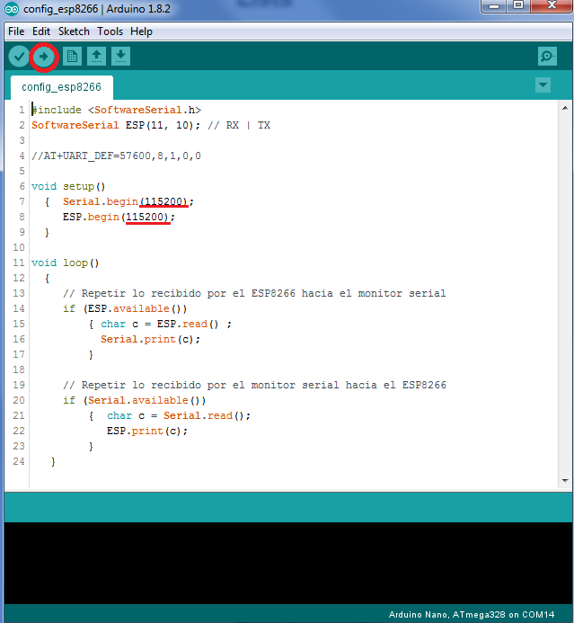
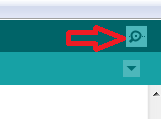

## Tutorial configuración ESP8266

1. Extraer el jumper de la placa
1. Conectar el dispositivo ESP8266 a la placa
1. Subir el archivo *config_esp8266* a la placa haciendo click en la flecha superior izquierda encerrada en rojo

1. Abrir el *Monitor Serial* haciendo click acá

1. Luego escribir AT y presionar ENTER. Debería aparecer **OK** en la pantalla
