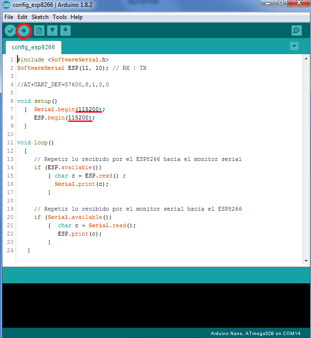

## Tutorial configuración ESP8266

1. Extraer el jumper de la placa
1. Conectar el dispositivo ESP8266 a la placa
1. Subir el archivo *config_esp8266* a la placa haciendo click en la flecha superior izquierda encerrada en rojo

1. Abrir el *Monitor Serial* haciendo click acá  

1. Luego escribir AT y presionar ENTER. Debería aparecer **OK** en la pantalla como se muestra en la siguiente imagen

1. Tras eso, se debe escribir el siguiente comando y luego ENTER "_AT+UART_DEF=57600,8,1,0,0_" Cabe destacar que debe ser sin comillas
1. Después de eso el dispositivo estará correctamente configurado y listo para usarse en el programa principal